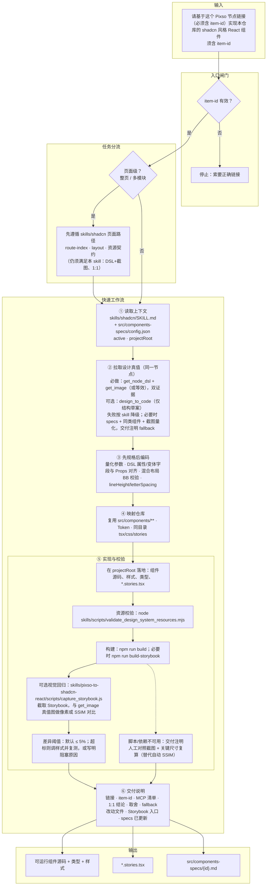

# Pixso → shadcn React 工作流（可视化）

本图与 `skills/pixso-to-shadcn-react/SKILL.md` 的「快速工作流」一致：MCP 降级不单独画分支，集中在步骤 ② 的文字说明中；步骤 ⑤ 使用子图内多行列表节点展开。

```mermaid
flowchart TB
  subgraph IN["输入"]
    Q["请基于这个 Pixso 节点链接（必须含 item-id）实现本仓库的 shadcn 风格 React 组件<br/>须含 item-id"]
  end

  subgraph Gate["入口闸门"]
    G{"item-id 有效？"}
    STOP["停止：索要正确链接"]
  end

  subgraph Branch["任务分流"]
    PG{"页面级？<br/>整页 / 多模块"}
    PGON["先遵循 skills/shadcn 页面路径<br/>route-index · layout · 资源契约<br/>（仍须满足本 skill：DSL+截图、1:1）"]
  end

  subgraph W["快速工作流"]
    S1["① 读取上下文<br/>skills/shadcn/SKILL.md<br/>+ src/components-specs/config.json<br/>active · projectRoot"]

    S2["② 拉取设计真值（同一节点）<br/>必做：get_node_dsl + get_image（或等效），双证据<br/>可选：design_to_code（仅结构草案）<br/>失败按 skill 降级；必要时 specs + 同类组件 + 截图量化，交付注明 fallback"]

    S3["③ 先规格后编码<br/>量化参数 · DSL 属性/变体字段与 Props 对齐 · 混合布局 BB 校验 · lineHeight/letterSpacing"]

    S4["④ 映射仓库<br/>复用 src/components/** · Token · 同目录 tsx/css/stories"]

    subgraph S5["⑤ 实现与校验"]
      direction TB
      S5a["在 projectRoot 落地：组件源码、样式、类型、*.stories.tsx"]
      S5b["资源校验：node skills/scripts/validate_design_system_resources.mjs"]
      S5c["构建：npm run build；必要时 npm run build-storybook"]
      S5d["可选视觉回归：skills/pixso-to-shadcn-react/scripts/capture_storybook.js<br/>截取 Storybook，与 get_image 真值图做像素或 SSIM 对比"]
      S5e["差异阈值：默认 ≤ 5%；超标则调样式并复测，或写明阻塞原因"]
      S5f["脚本/依赖不可用：交付注明人工对照截图 + 关键尺寸复算（替代自动 SSIM）"]
      S5a --> S5b --> S5c --> S5d --> S5e
      S5c -.-> S5f
    end

    S6["⑥ 交付说明<br/>链接 · item-id · MCP 清单 · 1:1 结论 · 取舍 · fallback<br/>改动文件 · Storybook 入口 · specs 已更新"]
  end

  subgraph OUT["输出"]
    O1["可运行组件源码 + 类型 + 样式"]
    O2["*.stories.tsx"]
    O3["src/components-specs/{id}.md"]
  end

  Q --> G
  G -->|否| STOP
  G -->|是| PG
  PG -->|是| PGON --> S1
  PG -->|否| S1
  S1 --> S2 --> S3 --> S4 --> S5a
  S5e --> S6
  S5f --> S6
  S6 --> O1 & O2 & O3
```

