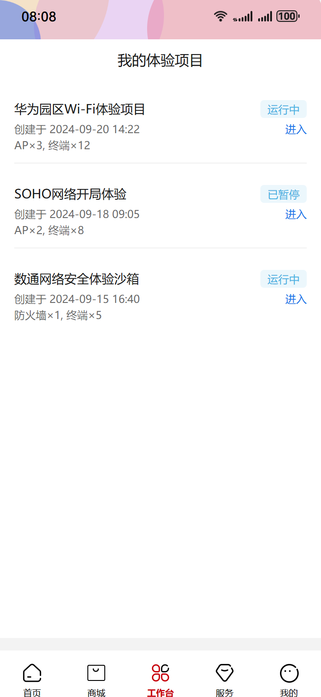
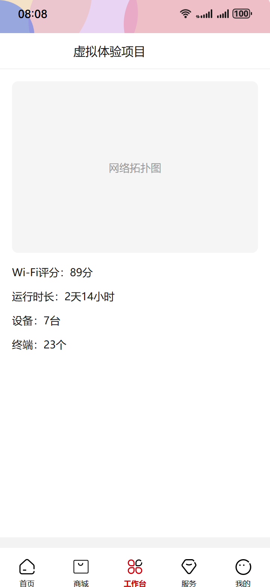
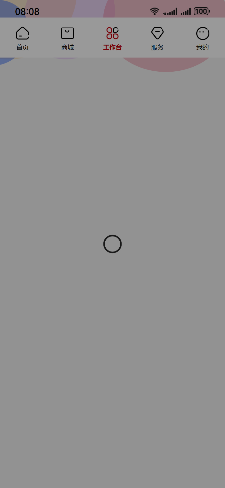
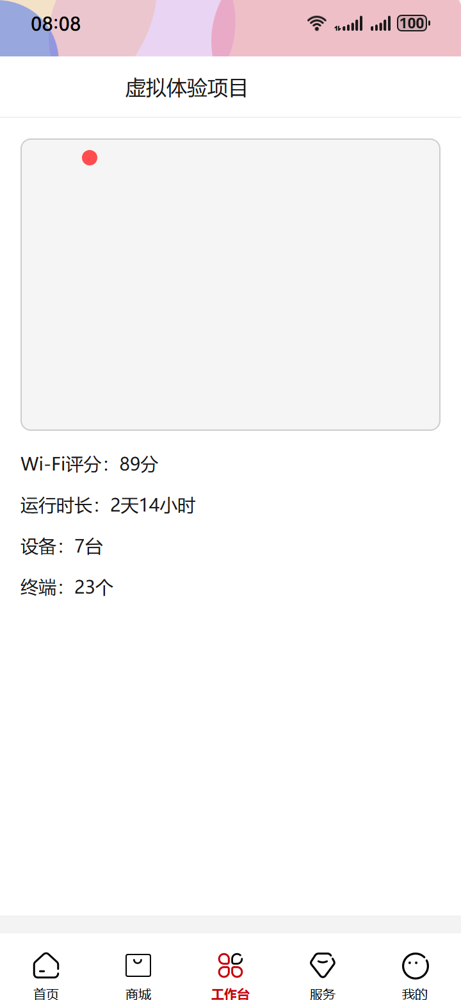
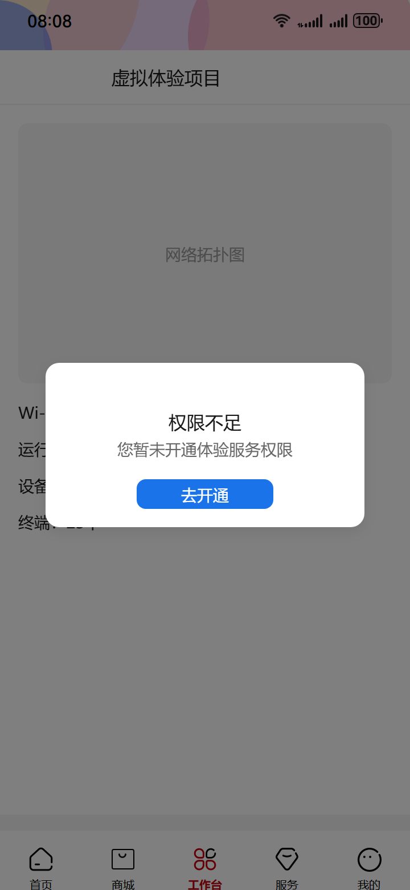

# Auto-run html2 — 2026-05-19_21-21-56

- brief: 用户从“我的工作台”点击“我的体验项目”→弹出内嵌列表弹窗，保留状态栏与底Tab→卡片展示项目名称、创建时间、设备类型与数量、状态标签及操作按钮→点击任一卡片→跳转全屏页面，顶部含返回键与“虚拟体验项目”标题，右侧有搜索、通知、加号图标→主体显示网络拓扑图、Wi-Fi评分、运行时长及设备与终端统计。
- source dir: new_test/3/html
- backend out dir: E:\任务流\任务流\p2p\saved-taskflow\20260520_052219_experience-project-view-flow
- session: tf_d89916f6f2cc

## Blueprint
- title: 体验项目查看与详情浏览
- user_story: 已登录的企业网络管理员在‘我的工作台’点击‘我的体验项目’入口，快速查看当前所有体验项目 → 系统按状态/时间聚合展示卡片 → 点击任一卡片进入详情页 → 全屏详情页完整渲染：含可交互拓扑图、实时Wi-Fi评分、运行时长倒计时、设备与终端统计数字准确显示

| state | name | last | applied | skipped | ms | screenshot | components |
|---|---|---|---|---|---|---|---|
| 1 | 工作台首页含体验项目入口 | - | 0 | 0 | - |  | (无) |
| 2 | 体验项目内嵌弹窗列表 | 1 | 1 | 0 | 99416 |  | (无) |
| 3 | 项目详情全屏页面 | 1 | 1 | 0 | 73014 |  | (无) |
| 4 | 卡片点击后加载中态 | 1 | 1 | 0 | 51729 |  | (无) |
| 5 | 网络拓扑图加载失败态 | 3 | 1 | 0 | 74834 |  | (无) |
| 6 | 权限不足提示浮层 | 3 | 1 | 0 | 83346 |  | (无) |

## State 详情

### state_1 — 工作台首页含体验项目入口
- description: 页面为全屏移动工作台主页，顶部状态栏显示时间与信号图标，底部固定Tab栏含‘首页’‘工作台’‘消息’‘我的’四标签；中部区域有一张横向卡片，标题为‘我的体验项目’，右向箭头图标，卡片背景浅灰，文字深灰16px加粗，无其他浮层或遮罩。
- implementation_method: 原始 HTML 初始快照，不做改造。
- 用到的鸿蒙组件 (0):

### state_2 — 体验项目内嵌弹窗列表
- description: 页面保持原有顶部状态栏与底部Tab栏可见；中部覆盖一层固定高度半屏白色弹窗（高约50vh），顶部有‘我的体验项目’标题（16px Medium 居中）、右侧关闭X图标；弹窗内垂直排列多张卡片，每张卡片含项目名称（14px Regular）、创建时间（12px Regular，灰色）、设备类型与数量（12px Regular，如‘AP×3, 终端×12’）、状态标签（圆角矩形，蓝底白字‘运行中’）、右侧‘进入’按钮（12px Regular，蓝色文字）。
- implementation_method: 内嵌弹窗 (Inline Modal)：固定高度半屏（50vh），白色背景，顶部标题‘我的体验项目’（HarmonyHeiTi-Medium 16px），右侧关闭X图标；每张卡片包含：项目名称文本（HarmonyHeiTi-Regular 14px）、创建时间文本（HarmonyHeiTi-Regular 12px，rgba(0,0,0,0.6)）、设备信息文本（HarmonyHeiTi-Regular 12px，如'AP×3, 终端×12'）、状态标签（圆角矩形，fill-info信息色info_1-14_365554-paragraph 蓝色文字，背景 fill-info信息色info_2-14_365553）、操作按钮‘进入’（HarmonyHeiTi-Regular 12px，fill-info信息色info_1-14_365554-paragraph）。
- 用到的鸿蒙组件 (0):

### state_3 — 项目详情全屏页面
- description: 全屏白色页面，顶部导航栏含左向返回箭头（24px SVG）、居中标题‘虚拟体验项目’（16px Medium）、右侧三个等距图标：搜索（20px SVG）、通知（20px SVG）、加号（20px SVG）；主体区顶部为网络拓扑图（宽100%，高228px，含多个椭圆节点与连线），下方依次为Wi-Fi评分（14px Regular，‘Wi-Fi评分：89分’）、运行时长（14px Regular，‘运行时长：2天14小时’）、设备统计（14px Regular，‘设备：7台’）、终端统计（14px Regular，‘终端：23个’）。
- implementation_method: 全屏页面 (Full-page View)：白色背景覆盖整个屏幕；顶部导航栏：左向返回箭头（Pixso-vector-146_139225）、标题‘虚拟体验项目’（HarmonyHeiTi-Medium 16px）、右侧三图标（Pixso-vector-146_139248 / Pixso-vector-146_139258 / Pixso-vector-146_139268）；主体区：网络拓扑图区域（Pixso-frame-14_884198 + 子节点椭圆图层）、Wi-Fi评分文本‘Wi-Fi评分：89分’（HarmonyHeiTi-Regular 14px）、运行时长文本‘运行时长：2天14小时’（HarmonyHeiTi-Regular 14px）、设备统计文本‘设备：7台’（HarmonyHeiTi-Regular 14px）、终端统计文本‘终端：23个’（HarmonyHeiTi-Regular 14px）。
- 用到的鸿蒙组件 (0):

### state_4 — 卡片点击后加载中态
- description: 全屏覆盖一层深灰半透明遮罩（rgba(0,0,0,0.4)），中央悬浮32px圆环spinner（深灰描边#191919，浅灰底，CSS animation:hmspin 1s linear infinite），原工作台页面内容完全不可见，顶部状态栏与底部Tab栏被遮罩覆盖，无任何文字提示。
- implementation_method: 加载中遮罩 (Loading Overlay)：全屏深灰半透明遮罩 rgba(0,0,0,0.4)；中央32px圆环spinner（stroke:#191919, stroke-width:2.5, width:32px, height:32px, CSS animation:hmspin 1s linear infinite）；无文字提示；顶部状态栏与底部Tab栏均被遮罩覆盖，不可见。
- 用到的鸿蒙组件 (0):

### state_5 — 网络拓扑图加载失败态
- description: 项目详情全屏页面中，网络拓扑图区域显示为一个空白矩形边框（1px实线，#CCCCCC），内部填充灰色斜线（SVG pattern），右上角叠加红色小角标（12px×12px圆形，#FF4D4F）；其余模块正常显示：Wi-Fi评分、运行时长、设备与终端统计文字全部可见且位置未偏移，顶部导航栏完整保留，无遮罩或浮层。
- implementation_method: 错误占位图 (Error Placeholder)：网络拓扑图区域替换为带灰色斜线填充的空白矩形边框（border:1px solid #CCCCCC；background-image:url('./image/error-pattern.svg')）；右上角红色小角标（Pixso-vector-146_139271，12px×12px，#FF4D4F）；Wi-Fi评分文本‘Wi-Fi评分：89分’、运行时长文本‘运行时长：2天14小时’、设备统计文本‘设备：7台’、终端统计文本‘终端：23个’全部正常渲染；顶部导航栏元素完整保留。
- 用到的鸿蒙组件 (0):

### state_6 — 权限不足提示浮层
- description: 页面中央悬浮一张圆角白卡（宽280px，高144px，背景#FFFFFF，阴影0 4px 12px rgba(0,0,0,0.08)），顶部居中锁形图标（24px SVG），下方标题‘权限不足’（16px Medium，#191919），中间说明文字‘您暂未开通体验服务权限’（14px Regular，#666666），底部‘去开通’主按钮（宽120px，高36px，背景#1A73E8，文字‘去开通’14px Medium 白色）；背景为深灰半透明遮罩（rgba(0,0,0,0.5)），原项目详情页内容整体变暗但结构可见。
- implementation_method: 轻量浮层 (Lightweight Modal)：圆角白卡（width:280px; height:144px; background:#FFFFFF; border-radius:12px; box-shadow:0 4px 12px rgba(0,0,0,0.08)）；顶部锁形图标（Pixso-vector-146_139225）；标题‘权限不足’（HarmonyHeiTi-Medium 16px, #191919）；说明文字‘您暂未开通体验服务权限’（HarmonyHeiTi-Regular 14px, #666666）；主按钮‘去开通’（width:120px; height:36px; background:#1A73E8; border-radius:8px; color:#FFFFFF; HarmonyHeiTi-Medium 14px）；背景遮罩 rgba(0,0,0,0.5)。
- 用到的鸿蒙组件 (0):