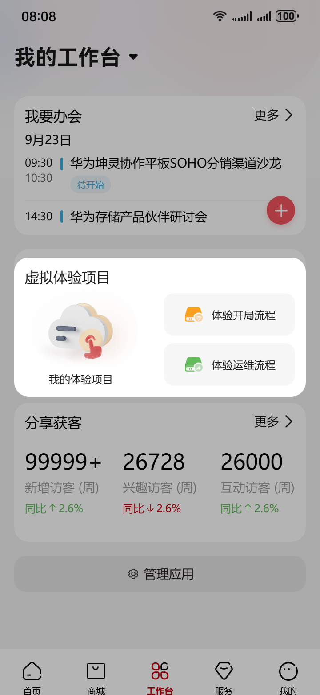
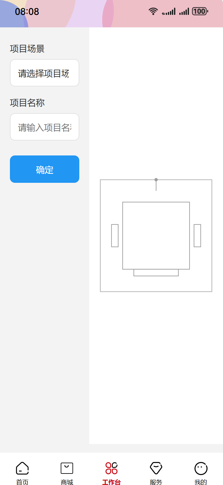
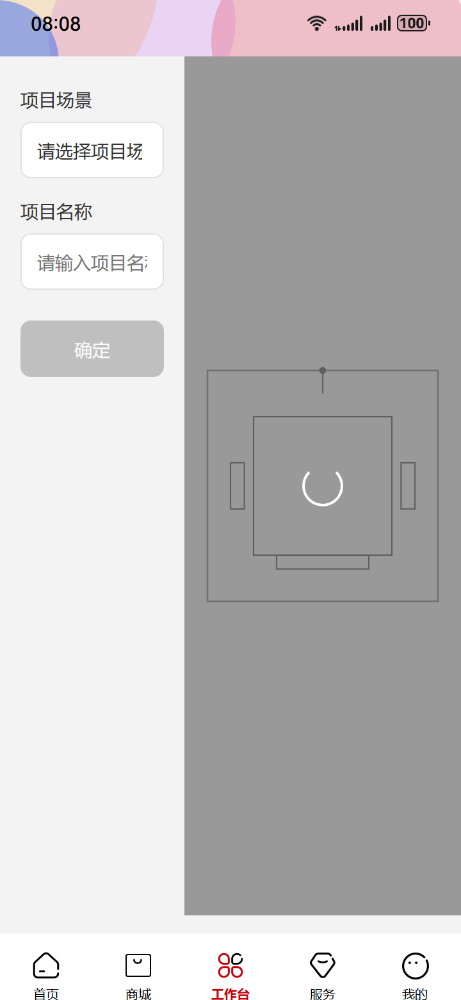
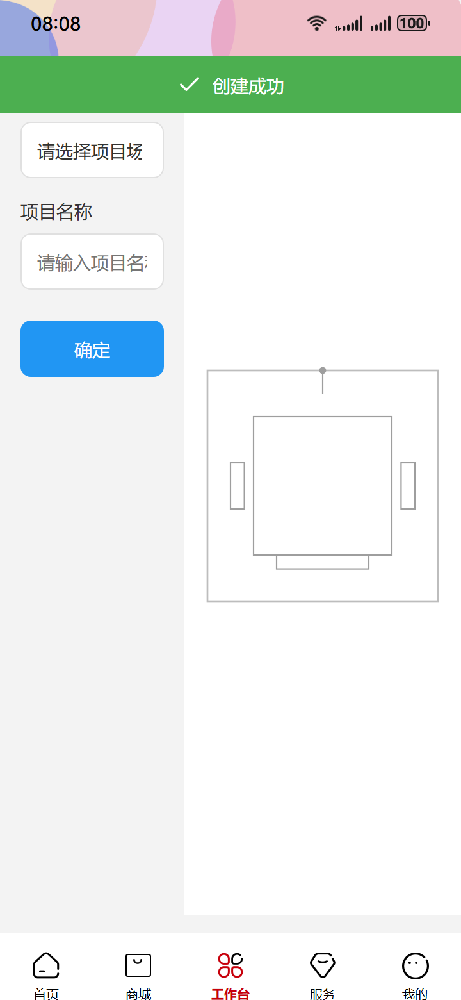
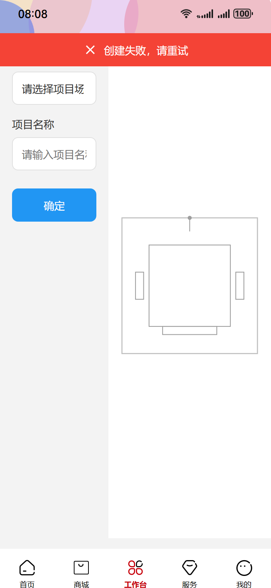
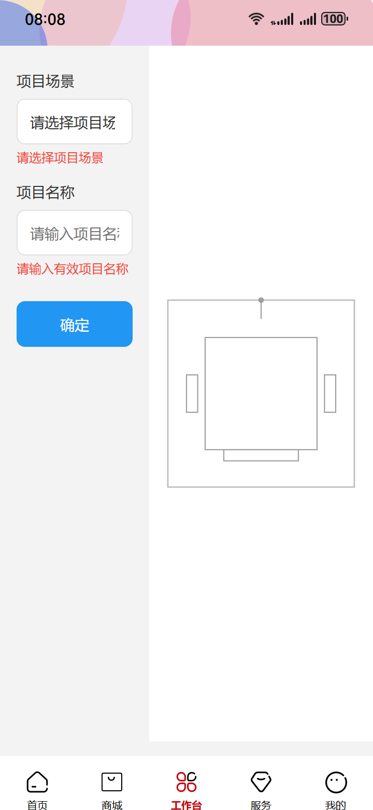

# Auto-run html2 — 2026-05-19_21-21-57

- brief: 用户在“我的工作台”页面点击“体验运维流程”按钮→进入全屏页，保留状态栏与底Tab→左侧填写预设的项目场景和项目名称，右侧显示三维设备模型→点击蓝色“确定”按钮提交→创建成功时提示“创建成功”，失败时提示“创建失败，请重试”。
- source dir: new_test/4/html
- backend out dir: E:\任务流\任务流\p2p\saved-taskflow\20260520_052215_experience-ops-flow
- session: tf_064a5de555e2

## Blueprint
- title: 体验运维流程
- user_story: 已登录的运维工程师 | 在‘我的工作台’点击‘体验运维流程’按钮 | 填写项目场景与名称 → 系统加载三维模型并校验字段 → 用户点击蓝色‘确定’完成提交 | 页面顶部弹出‘创建成功’Toast，且底Tab保持高亮在当前页

| state | name | last | applied | skipped | ms | screenshot | components |
|---|---|---|---|---|---|---|---|
| 1 | 我的工作台首页 | - | 0 | 0 | - |  | (无) |
| 2 | 运维流程全屏页 | 1 | 1 | 0 | 74079 |  | (无) |
| 3 | 提交中状态 | 2 | 1 | 0 | 75440 |  | (无) |
| 4 | 创建成功提示 | 2 | 1 | 0 | 150092 |  | (无) |
| 5 | 创建失败提示 | 2 | 1 | 0 | 79257 |  | (无) |
| 6 | 字段校验失败 | 2 | 1 | 0 | 75454 |  | (无) |

## State 详情

### state_1 — 我的工作台首页
- description: 页面为移动端全屏布局，顶部状态栏显示时间、信号与电量图标，底部 Tab 栏高 56px，当前‘我的工作台’Tab 高亮（深蓝底+白字），中部区域居中排列两个功能卡片：左为‘体验开局流程’，右为‘体验运维流程’按钮（蓝色填充、圆角矩形、14px Medium 字体、白色文字），其余区域为纯白背景。
- implementation_method: 原始 HTML 初始快照，不做改造
- 用到的鸿蒙组件 (0):

### state_2 — 运维流程全屏页
- description: 页面为全屏页，顶部状态栏（含时间/信号/电量）与底部 Tab 栏（‘我的工作台’Tab 仍高亮）均固定可见；页面横向分为左右两区：左侧占宽 40%，为浅灰背景表单区，含‘项目场景’下拉框（带向下的小三角图标）、‘项目名称’输入框（带灰色占位符‘请输入项目名称’）；右侧占宽 60%，为纯白背景三维模型容器，中央显示设备模型线框图（无文字、无遮罩、无加载指示）。
- implementation_method: 全屏内容页 (Fullpage View)：左侧表单区（40% 宽、#F3F3F3 背景）含下拉框控件（带向下箭头 SVG 图标、字体 14px Regular、深灰文字）、输入框控件（边框 1px #E0E0E0、圆角 8px、内边距 12px、占位符文字 '请输入项目名称'）；右侧模型区（60% 宽、#FFFFFF 背景）中央居中渲染设备线框图 SVG 或 canvas 占位图（无文字、无图标、无遮罩层）。
- 用到的鸿蒙组件 (0):

### state_3 — 提交中状态
- description: 页面结构与运维流程全屏页完全一致：顶部状态栏与底部 Tab 栏正常可见；左侧表单区不变，‘确定’按钮变为灰色不可点击态（#9E9E9E 背景、#FFFFFF 文字、opacity:0.6）；右侧三维模型容器内覆盖一层半透明深色遮罩（rgba(0,0,0,0.4)），遮罩中央显示白色旋转圆圈图标（直径 32px，stroke #FFFFFF，CSS animation:hmspin 1s linear infinite）。
- implementation_method: 按钮控件 (Button)：原蓝色‘确定’按钮改为 background-color:#9E9E9E、color:#FFFFFF、opacity:0.6；遮罩层 (Overlay)：absolute 定位覆盖整个右侧模型容器（60% 宽）、background:rgba(0,0,0,0.4)；旋转图标 (Spinner)：position:absolute 居中、width:32px、height:32px、border:2px solid #FFFFFF、border-top-color:transparent、animation:hmspin 1s linear infinite。
- 用到的鸿蒙组件 (0):

### state_4 — 创建成功提示
- description: 页面结构与运维流程全屏页完全一致：顶部状态栏与底部 Tab 栏正常可见；左侧表单区与右侧三维模型容器均保持原样；页面顶部状态栏正下方 16px 处，出现一条 100% 宽度、高 44px 的浅绿色横条（#4CAF50），横条内居中显示白色勾选图标（SVG）与文字‘创建成功’（14px Medium、HarmonyHeiTi-Medium、#FFFFFF），无关闭按钮，横条不遮挡状态栏也不遮挡表单区。
- implementation_method: 轻量级提示 (Toast/Snackbar)：top:0px + position:fixed + width:100vw + height:44px + background:#4CAF50 + padding:0 16px；内含 SVG 勾选图标（20px×20px、#FFFFFF）与文字 '创建成功'（14px Medium、#FFFFFF）；横条位于状态栏正下方、不重叠、不遮挡下方内容。
- 用到的鸿蒙组件 (0):

### state_5 — 创建失败提示
- description: 页面结构与运维流程全屏页完全一致：顶部状态栏与底部 Tab 栏正常可见；左侧表单区与右侧三维模型容器均保持原样；页面顶部状态栏正下方 16px 处，出现一条 100% 宽度、高 44px 的红色横条（#F44336），横条内居中显示白色叉号图标（SVG）与文字‘创建失败，请重试’（14px Medium、HarmonyHeiTi-Medium、#FFFFFF），无关闭按钮，横条不遮挡状态栏也不遮挡表单区。
- implementation_method: 轻量级提示 (Toast/Snackbar)：top:0px + position:fixed + width:100vw + height:44px + background:#F44336 + padding:0 16px；内含 SVG 叉号图标（20px×20px、#FFFFFF）与文字 '创建失败，请重试'（14px Medium、#FFFFFF）；横条位于状态栏正下方、不重叠、不遮挡下方内容。
- 用到的鸿蒙组件 (0):

### state_6 — 字段校验失败
- description: 页面结构与运维流程全屏页完全一致：顶部状态栏与底部 Tab 栏正常可见；左侧表单区中，‘项目场景’下拉框下方紧贴显示红色小字‘请选择项目场景’（12px Regular、#F44336、HarmonyHeiTi-Regular）；‘项目名称’输入框下方紧贴显示红色小字‘请输入有效项目名称’（12px Regular、#F44336、HarmonyHeiTi-Regular）；右侧三维模型容器内无任何遮罩或图标，仅显示原始设备线框图。
- implementation_method: 表单错误提示 (Form Error Text)：下拉框下方添加 p 元素，text '请选择项目场景'（12px Regular、#F44336）；输入框下方添加 p 元素，text '请输入有效项目名称'（12px Regular、#F44336）；两段文字均 margin-top:4px、line-height:16px、font-family:'HarmonyHeiTi-Regular'；右侧模型区保持原始状态，无新增 DOM。
- 用到的鸿蒙组件 (0):