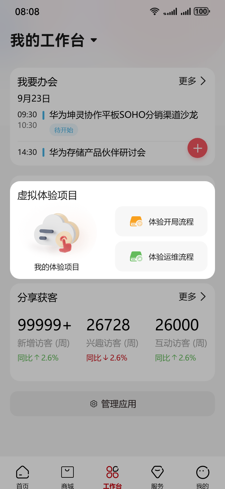
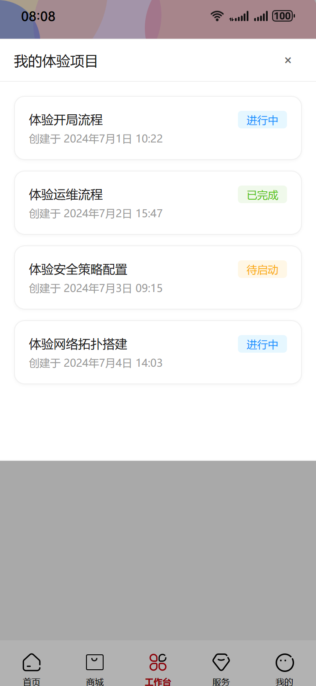
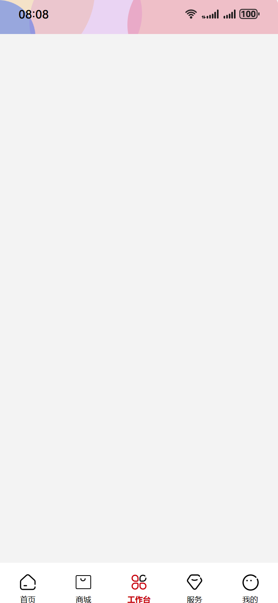
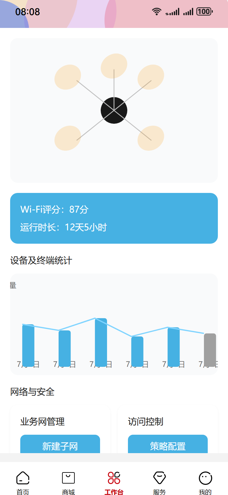
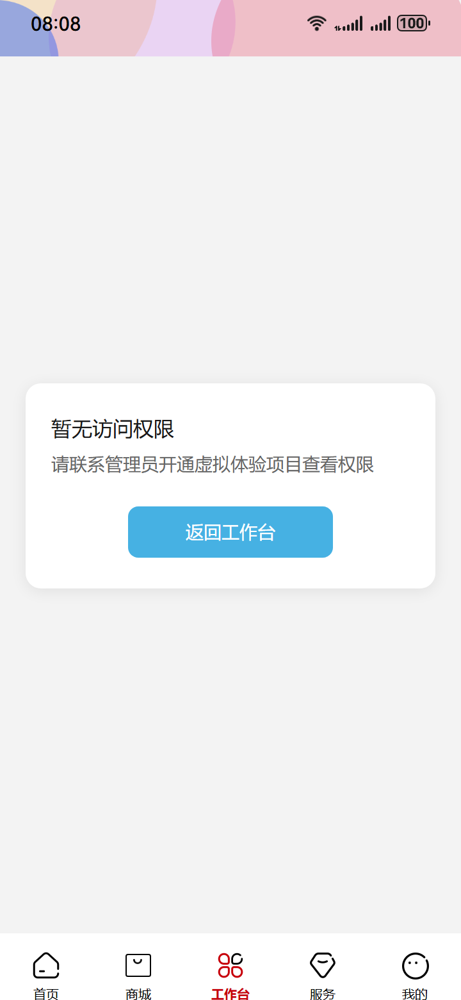
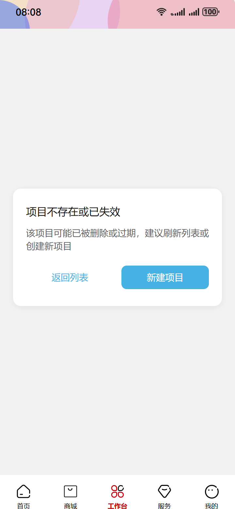

# Auto-run html2 — 2026-05-19_21-21-59

- brief: 用户在“我的工作台”点击“我的体验项目”→弹出内嵌列表弹窗，保留状态栏与底Tab→点击任一项目卡片→跳转全屏页面，顶部导航更新为“虚拟体验项目”并显示返回、搜索、通知、加号图标→页面展示设备拓扑图、Wi-Fi评分与运行时长、设备及终端统计、业务网管理与访问控制模块。
- source dir: new_test/5/html
- backend out dir: E:\任务流\任务流\p2p\saved-taskflow\20260520_052219_virtual-experience-project-view-flow
- session: tf_260faa355b85

## Blueprint
- title: 虚拟体验项目查看流程
- user_story: 已登录的企业网络管理员在‘我的工作台’点击‘我的体验项目’入口，快速掌握当前虚拟体验项目健康度，系统聚合Wi-Fi评分、设备在线率与运行时长生成摘要，用户滑动浏览即完成整体评估。

| state | name | last | applied | skipped | ms | screenshot | components |
|---|---|---|---|---|---|---|---|
| 1 | 我的工作台初始页 | - | 0 | 0 | - |  | (无) |
| 2 | 我的体验项目弹窗 | 1 | 1 | 0 | 91282 |  | (无) |
| 3 | 虚拟体验项目加载中 | 1 | 1 | 0 | 70117 |  | (无) |
| 4 | 虚拟体验项目就绪页 | 3 | 1 | 0 | 122485 |  | (无) |
| 5 | 权限不足提示页 | 3 | 1 | 0 | 76357 |  | (无) |
| 6 | 项目不存在或已失效页 | 3 | 1 | 0 | 81641 |  | (无) |

## State 详情

### state_1 — 我的工作台初始页
- description: 页面为全屏移动工作台首页，顶部状态栏显示时间/信号/电量，底部固定 TabBar 含‘工作台’‘项目’‘监控’‘我’四图标；中部主区域清晰展示‘我的体验项目’入口按钮（蓝色底+白色文字，居中卡片式布局），其余区域为空白内容区，背景色为 #F3F3F3。
- implementation_method: 原始 HTML 初始快照，不做改造
- 用到的鸿蒙组件 (0):

### state_2 — 我的体验项目弹窗
- description: 在 state_1 基础上，顶部状态栏下沿对齐处浮起固定高度内嵌弹窗（高约 480px），弹窗顶部无遮挡，底部精确停驻于 TabBar 上沿；弹窗内含可垂直滚动的项目卡片列表（每张卡片含项目名、创建时间、状态标签），右上角有‘取消’按钮（× 图标，灰色，16px）；弹窗外区域保持半透明遮罩（rgba(0,0,0,0.3)）。
- implementation_method: 内嵌浮层弹窗 (Inline Modal/Sheet)：固定高度 480px，顶部与状态栏下沿对齐，底部紧贴 TabBar 上沿；遮罩层 rgba(0,0,0,0.3) 覆盖除弹窗外全部区域；弹窗内为垂直滚动列表，每张卡片含标题‘体验开局流程’‘体验运维流程’等（14px HarmonyHeiTi-Regular，#191919），右上角‘取消’按钮（× 图标，16px，#666）；无其他操作控件。
- 用到的鸿蒙组件 (0):

### state_3 — 虚拟体验项目加载中
- description: 全屏页面，顶部导航栏已切换为‘虚拟体验项目’标题（16px HarmonyHeiTi-Medium，#191919），左侧返回箭头（黑色，24px）、右侧依次为搜索图标（24px 灰色）、通知图标（24px 灰色）、加号图标（24px 灰色）；导航栏下方为纯灰底（#F3F3F3）空白区域，无任何内容模块；状态栏与底部 TabBar 全部正常可见且未被遮挡。
- implementation_method: 全屏空白页 (Full-Screen Placeholder)：顶部导航栏完整渲染为‘虚拟体验项目’（16px HarmonyHeiTi-Medium，#191919），左侧返回图标（<，24px，#000），右侧搜索（🔍）、通知（🔔）、加号（+）三图标（均为 24px，#000，opacity:0.89）；导航栏下方至 TabBar 上沿区域为纯灰底 #F3F3F3，无文字、无图表、无占位符；状态栏与底部 TabBar 完整保留，无遮挡。
- 用到的鸿蒙组件 (0):

### state_4 — 虚拟体验项目就绪页
- description: 全屏页面，顶部导航栏为‘虚拟体验项目’标题（16px HarmonyHeiTi-Medium，#191919），左侧返回箭头（24px 黑色）、右侧搜索/通知/加号图标（24px 灰色）均可见；导航栏下方依次展示：设备拓扑图（SVG 或 Canvas 渲染，中心为网关节点，辐射连接多个设备椭圆）、Wi-Fi评分与运行时长卡片（蓝底浅色文字，含‘Wi-Fi评分：87分’‘运行时长：12天5小时’）、设备及终端统计图表（双柱状图+折线组合，X轴为日期，Y轴为数量）、业务网管理与访问控制模块（两列卡片式布局，左列‘业务网管理’含‘新建子网’按钮，右列‘访问控制’含‘策略配置’按钮）；状态栏与底部 TabBar 正常可见。
- implementation_method: 全屏内容页 (Full-Screen Content Page)：顶部导航栏同 state_3；下方内容区自上而下为：① 设备拓扑图（SVG 容器宽 100%，高 228px，含中心网关节点与 5 个辐射设备椭圆，使用 ./image/Ellipse_14_884199.png 等资源）；② Wi-Fi评分与运行时长卡片（蓝底 #46B1E3，白字，含文案‘Wi-Fi评分：87分’‘运行时长：12天5小时’）；③ 设备及终端统计图表（双柱状图+折线，X轴‘7月1日-7月7日’，Y轴‘数量’，柱体蓝/灰双色）；④ 业务网管理模块（左卡片标题‘业务网管理’+按钮‘新建子网’）与访问控制模块（右卡片标题‘访问控制’+按钮‘策略配置’），两列并排，卡片白底圆角；状态栏与底部 TabBar 完整保留。
- 用到的鸿蒙组件 (0):

### state_5 — 权限不足提示页
- description: 全屏页面，顶部导航栏为‘虚拟体验项目’标题（16px HarmonyHeiTi-Medium，#191919），左侧返回箭头（24px 黑色）、右侧搜索/通知/加号图标（24px 灰色）均可见；导航栏下方为纯灰底 #F3F3F3；中央悬浮白色卡片（宽 320px，圆角 12px，阴影 rgba(0,0,0,0.08)），卡片内含标题‘暂无访问权限’（16px HarmonyHeiTi-Medium，#191919）、正文‘请联系管理员开通虚拟体验项目查看权限’（14px HarmonyHeiTi-Regular，#666），底部仅一个‘返回工作台’按钮（蓝色底+白字，宽 160px，居中）；状态栏与底部 TabBar 正常可见。
- implementation_method: 全屏提示页 (Full-Screen Alert Card)：顶部导航栏同 state_3；中央白色卡片（320px×160px，圆角 12px，box-shadow: 0 2px 12px rgba(0,0,0,0.08)），含标题‘暂无访问权限’（16px HarmonyHeiTi-Medium，#191919）、正文‘请联系管理员开通虚拟体验项目查看权限’（14px HarmonyHeiTi-Regular，#666）、底部按钮‘返回工作台’（14px HarmonyHeiTi-Medium，#FFFFFF，背景 #46B1E3，宽 160px，居中）；其余区域为 #F3F3F3 灰底；状态栏与底部 TabBar 完整保留。
- 用到的鸿蒙组件 (0):

### state_6 — 项目不存在或已失效页
- description: 全屏页面，顶部导航栏为‘虚拟体验项目’标题（16px HarmonyHeiTi-Medium，#191919），左侧返回箭头（24px 黑色）、右侧搜索/通知/加号图标（24px 灰色）均可见；导航栏下方为纯灰底 #F3F3F3；中央悬浮白色卡片（宽 320px，圆角 12px，阴影 rgba(0,0,0,0.08)），卡片内含标题‘项目不存在或已失效’（16px HarmonyHeiTi-Medium，#191919）、正文‘该项目可能已被删除或过期，建议刷新列表或创建新项目’（14px HarmonyHeiTi-Regular，#666），底部两个按钮并排：左‘返回列表’（14px HarmonyHeiTi-Medium，#46B1E3）、右‘新建项目’（14px HarmonyHeiTi-Medium，#FFFFFF，背景 #46B1E3）；状态栏与底部 TabBar 正常可见。
- implementation_method: 全屏提示页 (Full-Screen Alert Card)：顶部导航栏同 state_3；中央白色卡片（320px×180px，圆角 12px，box-shadow: 0 2px 12px rgba(0,0,0,0.08)），含标题‘项目不存在或已失效’（16px HarmonyHeiTi-Medium，#191919）、正文‘该项目可能已被删除或过期，建议刷新列表或创建新项目’（14px HarmonyHeiTi-Regular，#666）、底部两按钮并排（左：‘返回列表’，14px HarmonyHeiTi-Medium，#46B1E3；右：‘新建项目’，14px HarmonyHeiTi-Medium，#FFFFFF，背景 #46B1E3，宽 100px，间距 12px）；其余区域为 #F3F3F3 灰底；状态栏与底部 TabBar 完整保留。
- 用到的鸿蒙组件 (0):