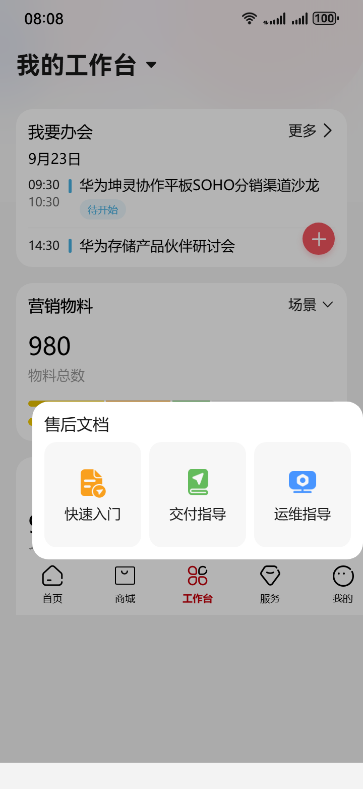
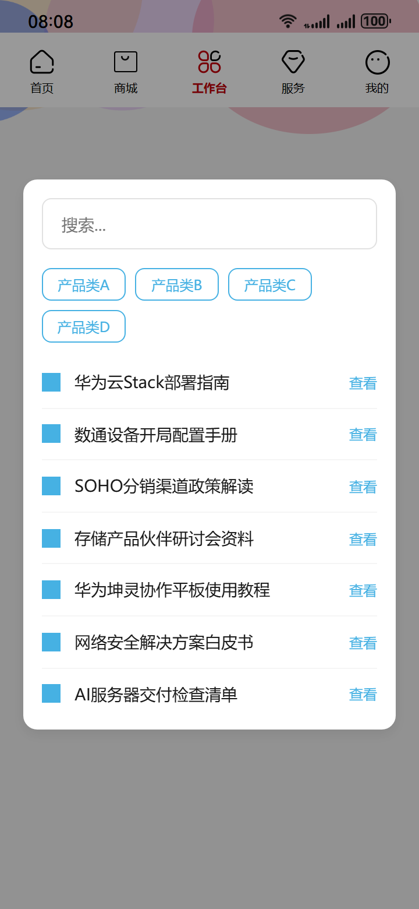
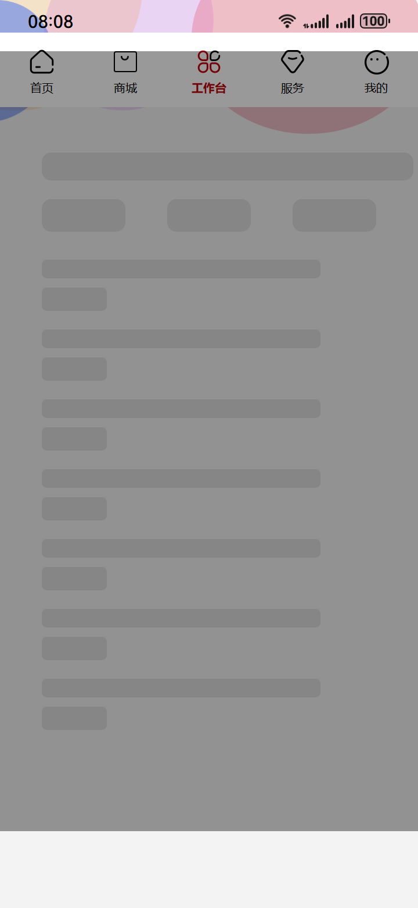
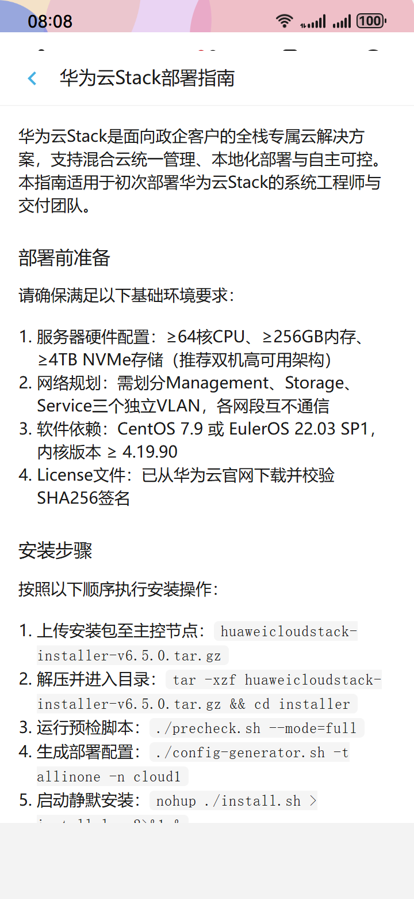
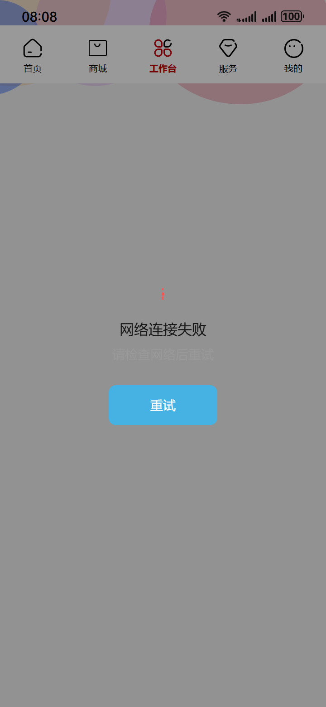

# Auto-run html2 — 2026-05-19_21-21-59

- brief: 用户在“我的工作台”点击“快速入门”按钮→全屏打开新页，保留状态栏与底Tab，原页面作半透明蒙层→新页中部显示带“搜索...”提示的搜索框，下方为四类产品分类标签，再下方展示7条带“查看”按钮的入门条目→点击任一“查看”按钮即跳转至对应产品文档详情页。
- source dir: new_test/6/html
- backend out dir: E:\任务流\任务流\p2p\saved-taskflow\20260520_052221_quick-start-doc-browse-flow
- session: tf_59de19c1db96

## Blueprint
- title: 快速入门文档浏览
- user_story: 已登录的普通员工在‘我的工作台’点击‘快速入门’按钮，系统按预设分类聚合展示7条高优先级条目，用户点击‘查看’即跳转至对应详情页

| state | name | last | applied | skipped | ms | screenshot | components |
|---|---|---|---|---|---|---|---|
| 1 | 我的工作台初始页 | - | 0 | 0 | - |  | (无) |
| 2 | 快速入门全屏浮层页 | 1 | 1 | 0 | 111225 |  | (无) |
| 3 | 快速入门加载中态 | 1 | 1 | 0 | 68244 |  | (无) |
| 4 | 快速入门就绪态 | 1 | - | - | - | - | (无) |
| 5 | 文档详情页 | 2 | 1 | 0 | 90210 |  | (无) |
| 6 | 网络失败提示态 | 1 | 1 | 0 | 94232 |  | (无) |

## State 详情

### state_1 — 我的工作台初始页
- description: 页面为完整移动端工作台首页，顶部状态栏显示时间与信号图标，底部Tab栏含‘首页’‘工作台’‘消息’‘我的’四枚图标并高亮‘工作台’，中部区域包含功能卡片组，其中‘快速入门’卡片位于左上第一位置，卡片内含蓝色圆形图标与‘快速入门’文字（16px Medium，深灰#191919），无任何浮层或遮罩。
- implementation_method: 原始 HTML 初始快照，不做改造
- 用到的鸿蒙组件 (0):

### state_2 — 快速入门全屏浮层页
- description: 顶部状态栏与底部Tab栏保持完全可见且交互正常，背景为原工作台页整体半透明蒙层（rgba(0,0,0,0.4)），中部垂直居中显示宽320px圆角搜索框（高44px，浅灰边框#E1E1E1，内嵌‘搜索...’提示文字，14px Regular，浅灰#999），下方并排四枚蓝色描边标签（宽72px×高28px，圆角8px，描边#46B1E3，文字‘产品类A’/‘产品类B’/‘产品类C’/‘产品类D’，12px Regular，深蓝#46B1E3），再下方七行卡片式条目：每行含左对齐16×16产品图标、14px深灰标题文本、右对齐‘查看’文字按钮（12px Medium，主色#46B1E3），所有元素间距均匀，无骨架、无加载动画。
- implementation_method: 全屏浮层 (Overlay Modal)：背景为 rgba(0,0,0,0.4) 半透明遮罩；中部容器宽320px，垂直居中；搜索框为 input[type='text'] 元素，placeholder='搜索...'；四枚标签为 button 元素，文案分别为 '产品类A' / '产品类B' / '产品类C' / '产品类D'；七条条目为 div.card 行容器，每行含 img.icon（16×16）、p.title（14px，#191919）、button.view-btn（12px Medium，#46B1E3）；所有文字中英文均未出现，仅中文。
- 用到的鸿蒙组件 (0):

### state_3 — 快速入门加载中态
- description: 顶部状态栏与底部Tab栏保持完全可见且交互正常，背景为原工作台页整体半透明蒙层（rgba(0,0,0,0.4)），中部垂直居中显示宽320px灰色圆角矩形骨架（高24px，背景色 rgba(0,0,0,0.08)），下方三行等宽浅灰标签骨架（每行宽72px×高28px，圆角8px，背景色 rgba(0,0,0,0.08)），再下方七组‘标题行+按钮行’骨架：每组含一行高16px浅灰横条（背景色 rgba(0,0,0,0.08)）和一行高20px浅灰横条（背景色 rgba(0,0,0,0.08)），所有骨架无动画、无波纹、无闪烁，呈静态灰阶视觉。
- implementation_method: 全屏浮层 (Overlay Modal)：背景为 rgba(0,0,0,0.4) 半透明遮罩；中部容器宽320px，垂直居中；搜索框骨架为 div.skeleton-search（宽320px×高24px，圆角8px，背景 rgba(0,0,0,0.08)）；四类标签骨架为三行 div.skeleton-tag（宽72px×高28px，圆角8px，背景 rgba(0,0,0,0.08)）；七组条目骨架为 div.skeleton-item，每组含 div.skeleton-title（宽240px×高16px，圆角4px，背景 rgba(0,0,0,0.08)）与 div.skeleton-btn（宽56px×高20px，圆角4px，背景 rgba(0,0,0,0.08)）；所有元素无 CSS animation 或 transition。
- 用到的鸿蒙组件 (0):

### state_4 — 快速入门就绪态
- description: 顶部状态栏与底部Tab栏保持完全可见且交互正常，背景为原工作台页整体半透明蒙层（rgba(0,0,0,0.4)），中部垂直居中显示宽320px圆角搜索框（高44px，浅灰边框#E1E1E1，内嵌‘搜索...’提示文字，14px Regular，浅灰#999），下方并排四枚蓝色描边标签（宽72px×高28px，圆角8px，描边#46B1E3，文字‘产品类A’/‘产品类B’/‘产品类C’/‘产品类D’，12px Regular，深蓝#46B1E3），再下方七行卡片式条目：每行含左对齐16×16产品图标、14px深灰标题文本、右对齐‘查看’文字按钮（12px Medium，主色#46B1E3），所有元素间距均匀，无骨架、无加载动画，全部内容稳定渲染完成。
- implementation_method: 全屏浮层 (Overlay Modal)：背景为 rgba(0,0,0,0.4) 半透明遮罩；中部容器宽320px，垂直居中；搜索框为 input[type='text'] 元素，placeholder='搜索...'；四枚标签为 button 元素，文案分别为 '产品类A' / '产品类B' / '产品类C' / '产品类D'；七条条目为 div.card 行容器，每行含 img.icon（16×16）、p.title（14px，#191919）、button.view-btn（12px Medium，#46B1E3）；所有文字中英文均未出现，仅中文。
- **FAILED**: LLM 返回空
- 用到的鸿蒙组件 (0):

### state_5 — 文档详情页
- description: 顶部固定标题栏显示当前产品名称（16px Medium，深灰#191919），左侧返回箭头图标（24×24，主色#46B1E3），右侧无操作按钮；正文区域为纯白背景（#FFFFFF），段落文字深灰#191919、14px Regular、行高20px；含二级标题（16px Medium）、步骤说明（带数字序号列表）、代码块（浅灰背景#F5F5F5，13px mono字体）、嵌入图片（宽100%，高自适应）；底部无Tab栏，顶部状态栏可见，页面无浮层、无遮罩、无搜索框或标签。
- implementation_method: 独立文档页 (Standalone Page)：顶部导航栏含 left-arrow icon（24×24，#46B1E3）与 title（16px Medium，#191919）；正文区 div.content 背景 #FFFFFF；段落 p（14px Regular，#191919，line-height:20px）；h2 标题（16px Medium，#191919）；ol.step-list（list-style-type: decimal；margin-left: 16px）；pre.code-block（background #F5F5F5；font-size:13px；font-family: monospace）；img（max-width:100%；height:auto）；无底部Tab，无状态栏遮挡。
- 用到的鸿蒙组件 (0):

### state_6 — 网络失败提示态
- description: 顶部状态栏与底部Tab栏保持完全可见且交互正常，背景为原工作台页整体半透明蒙层（rgba(0,0,0,0.4)），中部垂直居中显示红色感叹号图标（24×24，#FF5252），下方紧接标题‘网络连接失败’（16px Medium，深灰#191919），再下方为正文‘请检查网络后重试’（14px Regular，浅灰#999），底部居中显示蓝色‘重试’按钮（宽120px×高44px，圆角8px，背景#46B1E3，文字‘重试’14px Medium，白色#FFFFFF），无其他图标、输入框或标签。
- implementation_method: 全屏浮层 (Overlay Modal)：背景为 rgba(0,0,0,0.4) 半透明遮罩；中部容器宽320px，垂直居中；div.error-icon（24×24，#FF5252，SVG 或 img）；h2.title（16px Medium，#191919，'网络连接失败'）；p.message（14px Regular，#999，'请检查网络后重试'）；button.retry-btn（宽120px×高44px，圆角8px，背景#46B1E3，文字'重试'，14px Medium，#FFFFFF）；所有元素无动画、无悬停态、无过渡效果。
- 用到的鸿蒙组件 (0):